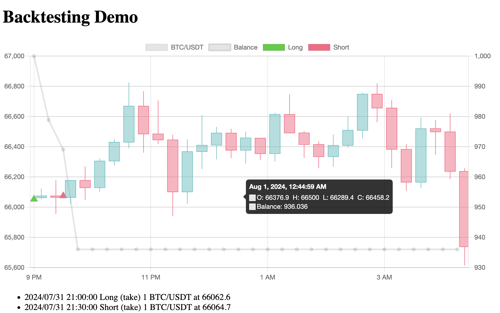

# Quantstorm

**Quantstorm** is a quant-centric platform for **backtesting** and **live trading**, providing a unified and
trader-friendly interface for developing, backtesting, and deploying dependable trading strategies.

### Key Features

- Unified backtesting and live trading framework
- Stateful strategy abstraction
- Broker abstraction for multi-exchange compatibility
- K-line data abstraction
- Extensible indicator

---

## Getting Started

### 1. Install Dependencies

Install [pnpm](https://pnpm.io/), then run:

```bash
$ pnpm install
```

### 2. Set Up Environment Variables

Copy `.env.example` to `.env` and fill in the configuration.

---

## Strategy

All strategies in **Quantstorm** are implemented by extending the `StrategyAbstract` base class and must be **explicitly
registered** in the [StrategyRegistry](src/strategy/strategy.registry.ts).

### Initialization

`init(args: string)` is called **once** at the start of strategy execution. It is responsible for setting up the
strategy’s internal state and dependencies.

- The `args` parameter (a JSON string) allows for dynamic configuration.
- Typical `args` include:
    - Trading pair (e.g., `BTC/USDT`)
    - Order size
    - Selected exchange/broker
    - Any strategy-specific parameters or flags

### Periodical Execution

`next()` contains the core trading logic and is executed at **fixed intervals**. It is used to react to new market data,
generate trading signals, and perform trading actions (e.g., long/short).

- The interval defines the period between two strategy executions
    - Configurable interval for backtesting (e.g., `1m`, `15m`)
    - Defaults to **5 seconds** for live trading

### Example

- [Demo Strategy](src/strategy/demo)
- [Neutral Grid Strategy](src/strategy/neutral_grid)

---

## Backtesting

### With Test Cases (Recommended)

1. Create a mock `service: BacktestService` (see [backtest.service.spec.ts](src/backtest/backtest.service.spec.ts))
2. Write a unit test:

```typescript
it("should backtest the strategy", async () => {
  const result: BacktestResult = await service.run(
    strategyInstance, // A strategy object
    strategyArgs, // Arguments to initialize the strategy
    startTimestamp, // Backtest start timestamp
    endTimstamp, // Backtest end timestamp
    executionInterval // Backtest execution interval
  );
});
```

3. Run the test case and obtain backtesting result instance `result: BacktestResult`

#### Build Backtesting Data

Modify and run the test case `should build Binance K-line data set`
in [backtest.feeder.service.spec.ts](src/backtest/feeder/backtest.feeder.service.spec.ts)

#### Example

Backtest Demo strategy by running the test case
`should backtest the demo strategy` in [backtest.service.spec.ts](src/backtest/backtest.service.spec.ts)

### With Web Service

#### Start Quantstorm

```bash
# development
$ npm run start

# watch mode
$ npm run start:dev

# production mode
$ npm run start:prod
```

#### Build Backtesting Data

Call the endpoint `/backtest/build/kline` with arguments:

- **base**: Base currency (e.g., `BTC`)
- **quote**: Quote currency (e.g., `USDT`)
- **interval**: Strategy execution interval (e.g., `1m`, `15m`)
- **start**: Start date in `YYYY-MM-DD` format
- **end**: End date in `YYYY-MM-DD` format

#### Backtest Strategy with UI

Access the endpoint `/backtest/strategy/{name}` with arguments:

- **{name}**: Strategy name (e.g., `Demo`)
- **start**: Start timestamp (UNIX format)
- **end**: End timestamp (UNIX format)
- **interval**: Strategy execution interval (e.g., `1m`, `15m`)
- **base**: Base currency (e.g., `BTC`) used for visualization
- **quote**: Quote currency (e.g., `USDT`) used for visualization and balance calculation
- *args*: Arguments to initialize the strategy

#### Example

1. Locally run Quantstorm on port `8888`
2. Backtest the Demo strategy via the URL below

```
http://localhost:8888/backtest/strategy/Demo?start=1722427200&end=1722454200&interval=15m&base=BTC&quote=USDT&args={"base":"BTC","quote":"USDT","size":1,"interval":"30m"}
```

3. Obtain the backtesting result in HTML
   

---

## Live Trading

### Deployment

1. Install [Docker Compose](https://docs.docker.com/compose/)
2. In the root directory:

```shell
$ docker compose up -d
```

This launches:

- Quantstorm
- MariaDB
- Adminer

### Execute Strategy

Call the endpoint `/executor/execute/{name}/{id}` with arguments:

- **{name}**: Strategy name
- **{id}**: Custom unique identifier for the strategy instance
- **args**: Arguments to initialize the strategy

### Stop Strategy

Access the endpoint `/executor/stop/{id}` with arguments:

- **{id}**: Custom unique identifier for the strategy instance
